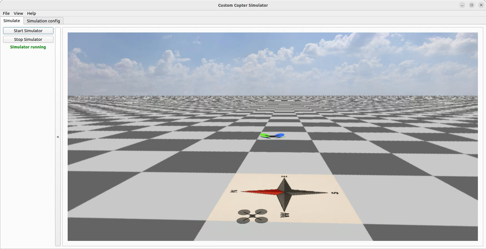
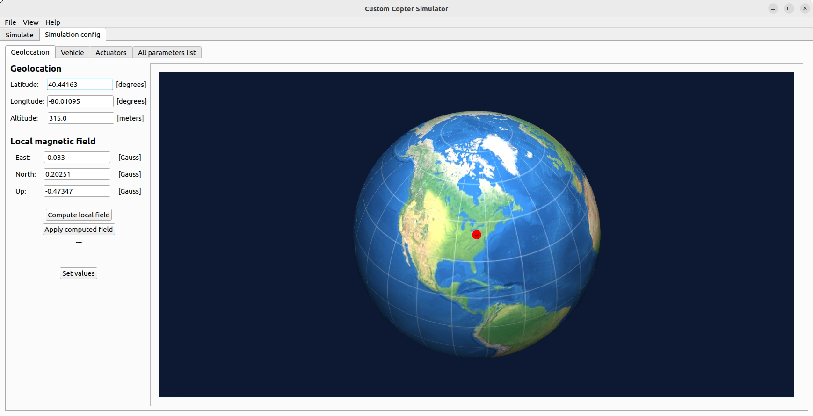
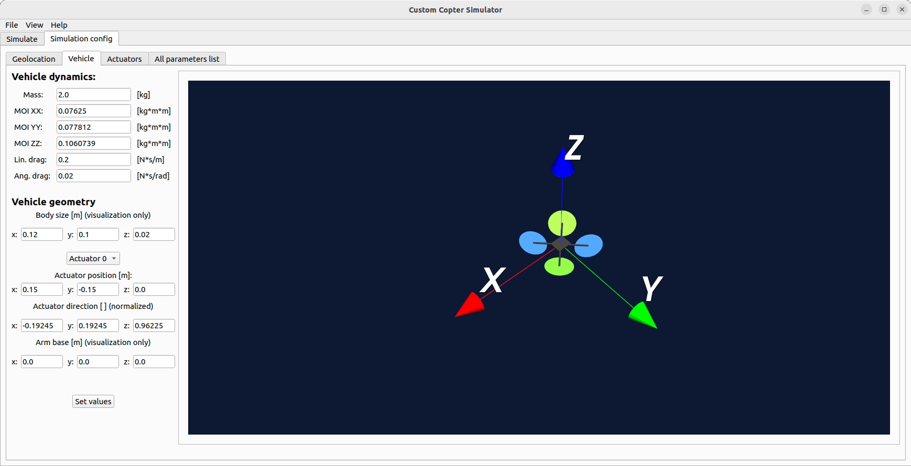
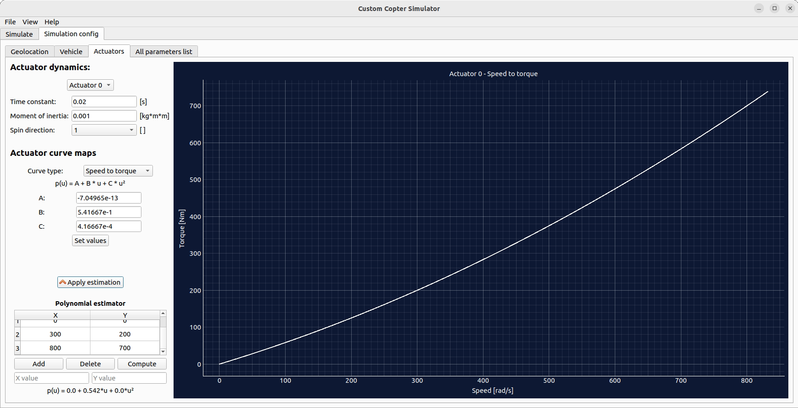
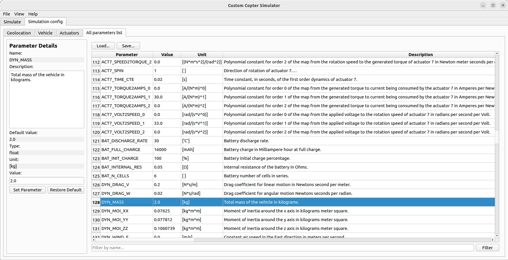
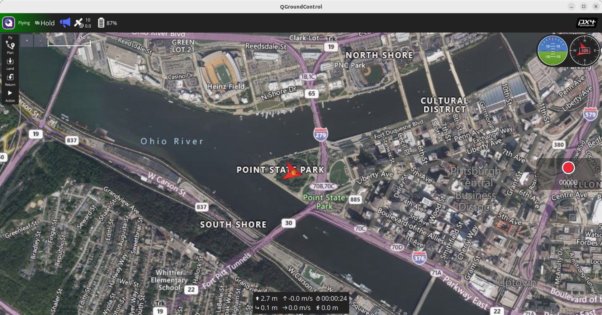

# sim4cd - Simulator for a Custom Drone

This package is a simulator tailored for quadcopters with fixed rotors. It offers configurable drone characteristics, allowing users to replicate their own platform. Currently, the simulator integrates seamlessly with PX4 firmware.

sim4cd is a plain Python package. It talks to PX4 over MAVLink (`pymavlink`) and to its own GUI over ZMQ,
so ROS is not required to run it. There is an optional ROS bridge for RViz visualization, described at the
end of this file.

The instructions below use `~/sim4cd_ws` as the workspace, with PX4 checked out next to sim4cd. Any
directory works; only the relative layout matters, and it can be overridden with `PX4_DIR`.

## Docker setup

Clone sim4cd

```bash
mkdir -p ~/sim4cd_ws/src
cd ~/sim4cd_ws/src
git clone https://github.com/adrianomcr/sim4cd.git
cd sim4cd
```

Build the image. It is based on Ubuntu 24.04 and builds PX4 SITL, so the first build takes a while.

```bash
docker compose -f docker-compose.yaml build
```

Give docker access to the X server

```bash
xhost +local:docker
```

Run the Qt GUI

```bash
docker compose -f docker-compose.yaml run --rm sim4cd
```

Or get a shell in the container instead

```bash
docker compose -f docker-compose.yaml run --rm sim4cd bash
```

## Native setup

### Clone the repo

The Qt GUI lives on the `add-python-qt-gui` branch.

```bash
mkdir -p ~/sim4cd_ws/src
cd ~/sim4cd_ws/src
git clone -b main https://github.com/adrianomcr/sim4cd.git
```

### System packages

```bash
sudo apt update
sudo apt install -y git build-essential cmake ninja-build \
  python3-venv python3-pip python3-dev \
  libgl1 libglib2.0-0 libxkbcommon-x11-0 \
  libxcb-xinerama0 libxcb-cursor0 libxcb-icccm4 \
  libxcb-image0 libxcb-keysyms1 libxcb-randr0 \
  libxcb-render-util0 libxcb-shape0
```

On Ubuntu 24.04, install `python3.12-venv` if `python3-venv` is not available. You can skip `libglib2.0-0`
if apt reports it was renamed to `libglib2.0-0t64`.

### Python dependencies (venv)

Ubuntu 23.04 and later block installing pip packages into the system Python (PEP 668). Use a virtualenv:

```bash
cd ~/sim4cd_ws/src/sim4cd
python3 -m venv .venv
source .venv/bin/activate
pip install -r requirements.txt
```

`vtk` is pinned to 9.4.1 in `requirements.txt` (9.6+ rotates the home-tab skybox).

### Build PX4 SITL

Clone PX4 next to sim4cd:

```bash
cd ~/sim4cd_ws/src
git clone --depth 1 --branch v1.13.3 https://github.com/PX4/PX4-Autopilot.git PX4
git -C PX4 submodule update --depth 1 --init --recursive
cd PX4
make distclean
```

Install the build-time Python dependencies from PX4's own requirements file. One line in it uses a version specifier that pip 24+ rejects (`matplotlib>=3.0.*`), so patch it first:
```bash
sed -i 's|matplotlib>=3.0\.\*|matplotlib>=3.0|' Tools/setup/requirements.txt
```

Then, with the sim4cd virtualenv active:

```bash
pip install -r Tools/setup/requirements.txt
pip install 'empy==3.3.4'
```

The virtualenv must stay **activated while running `make`**, since the PX4 build shells out to `python3`
for code generation. Installing into the system Python works too on Ubuntu 20.04/22.04; on 23.04 and later
add `--user --break-system-packages`, which installs into `~/.local` without touching any apt-owned file.

The second `empy` command is required on every distro. v1.13.3 asks for `empy>=3.3`, which now resolves to 4.x, and 4.x breaks the PX4 uORB code generation with `module 'em' has no attribute 'RAW_OPT'`.

Build SITL
```bash
DONT_RUN=1 make px4_sitl none_iris
```

On GCC 12 and newer (Ubuntu 22.04 ships GCC 11, 24.04 ships GCC 13), this fails in `src/lib/matrix` with `error: array subscript 1 is above array bounds of 'float [1][1]' [-Werror=array-bounds]`. It is a false positive in an unreachable branch of `matrix::inv()`, fixed in later PX4 releases. Stop v1.13.3 from treating warnings as errors and rebuild:
```bash
sed -i 's|^\(\s*\)-Werror$|\1-Wno-error|' cmake/px4_add_common_flags.cmake
DONT_RUN=1 make px4_sitl none_iris
```

`scripts/sim4cd/start_sim.sh` finds PX4 by looking for a `PX4` or `PX4-Autopilot` directory next to the
repo. If you cloned it somewhere else, point `PX4_DIR` at it:

```bash
export PX4_DIR=/path/to/PX4-Autopilot
```

### Optional: Unity visualization

`scripts/sim4cd/start_sim.sh` also starts a Unity player export (`sim4cdExample.x86_64`) and
`scripts/unity/update_unity_cam_pose.py`, which forwards the simulated vehicle pose to the camera in the
Unity scene (`scripts/unity/CameraController.cs`). The bridge reads the state from the same ZMQ socket the
Qt GUI uses, so it needs `SIM_VIZ_EN` enabled in the parameter file.

The export is not in the repository, since it is too large to track. The script looks for a `unity`
directory in or next to the repo, and skips the visualization when it finds nothing. To use an export kept
somewhere else, point `SIM4CD_UNITY_BIN` at the executable:

```bash
export SIM4CD_UNITY_BIN=/path/to/sim4cdExample.x86_64
```

`SIM4CD_UNITY_DIR` works too, and expects a directory containing `sim4cdExample.x86_64`.

### Install QGroundControl

QGroundControl is used as the ground control station.

```bash
sudo usermod -a -G dialout $USER # Needs to log out and log in
sudo apt-get remove modemmanager -y
sudo apt install gstreamer1.0-plugins-bad gstreamer1.0-libav gstreamer1.0-gl -y
sudo apt install libqt5gui5 -y
sudo apt install libfuse2 -y
```

Download the AppImage from [https://docs.qgroundcontrol.com/master/en/qgc-user-guide/getting_started/download_and_install.html](https://docs.qgroundcontrol.com/master/en/qgc-user-guide/getting_started/download_and_install.html).

```bash
cd ~/Downloads
chmod +x ./QGroundControl.AppImage
```

## Qt GUI

The Qt GUI is the main way to load a vehicle config and start the simulator (`Start Simulator` runs `scripts/sim4cd/start_sim.sh`).

### Run

From `scripts/qt_gui`, with `scripts/` on `PYTHONPATH` so `sim4cd` imports resolve:

```bash
cd ~/sim4cd_ws/src/sim4cd/scripts/qt_gui
PYTHONPATH=.. python3 qt_sim4cd.py
```

Alternatively, from the repo root with the venv active:

```bash
pip install -e .
sim4cd-gui
```

### Screenshots

Simulate tab: start and stop the simulator and follow the vehicle in the 3D scene  


Simulation config: geographic location of the simulation origin and local magnetic field  


Simulation config: vehicle dynamics and geometry, with the actuator layout rendered as it is edited  


Simulation config: actuator dynamics and curve maps, with the polynomial estimator  


Simulation config: full list of simulator parameters  


QGroundControl connected to the running simulation, at the configured geolocation  


## Optional: ROS integration

The simulator does not need ROS, but the repository also ships a ROS 1 (Noetic) bridge that publishes the
vehicle state as topics and renders it in RViz: `scripts/sim4cd/ros_viz.py`, `scripts/sim4cd/sim_ros.py`,
`launch/sim4cd.launch`, `rviz/basic.rviz`, plus the `package.xml` and `CMakeLists.txt` that make the repo a
catkin package. None of this is used by the Qt GUI or by `sim4cd_main.py`.

To use it, clone the repo into a catkin workspace and build it there:

```bash
mkdir -p ~/catkin_ws/src
cd ~/catkin_ws/src
git clone -b main https://github.com/adrianomcr/sim4cd.git
cd ~/catkin_ws
catkin build
```

MAVROS is also optional, and is what lets PX4 itself appear on the ROS graph:

```bash
sudo apt install ros-noetic-mavros
roscd mavros/../../lib/mavros/
sudo ./install_geographiclib_datasets.sh
pip3 install pymavlink
```

ROS Noetic is Ubuntu 20.04 only, so this whole section is limited to that distro. The Docker image is
Ubuntu 24.04 and does not contain ROS.

## Legacy Tk GUI

The original Tk GUI is still available in `scripts/gui/`. It is superseded by the Qt GUI, but it works and
uses the same JSON parameter files. See [scripts/gui/README.md](scripts/gui/README.md).
