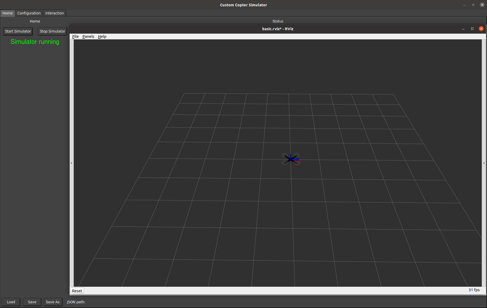
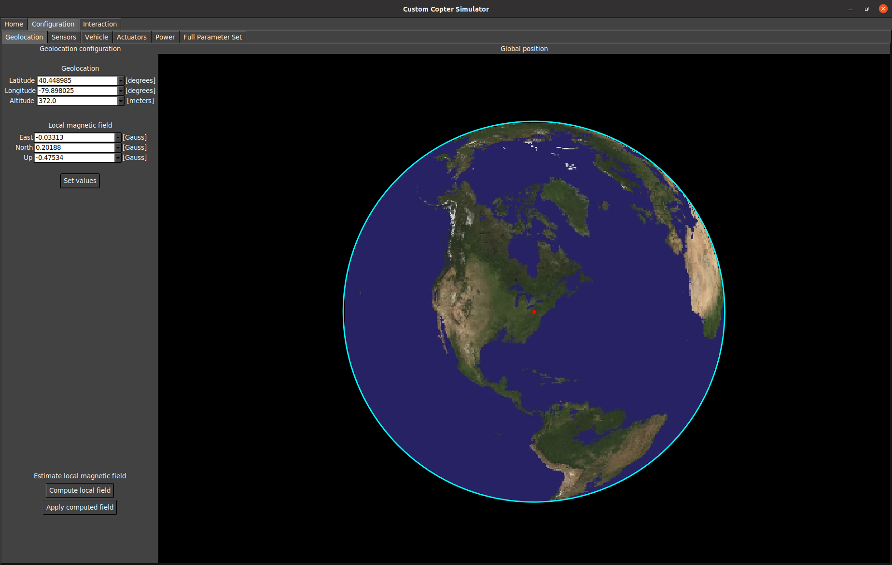
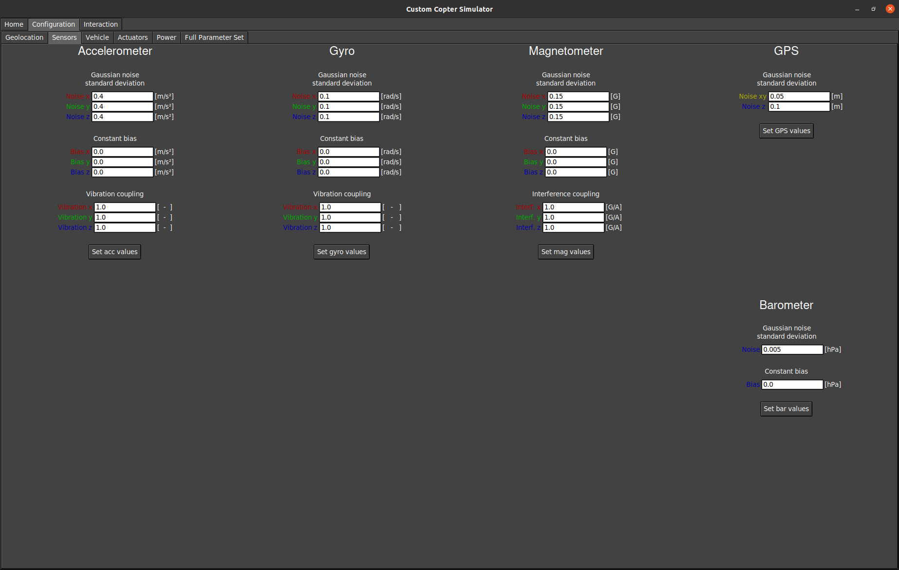
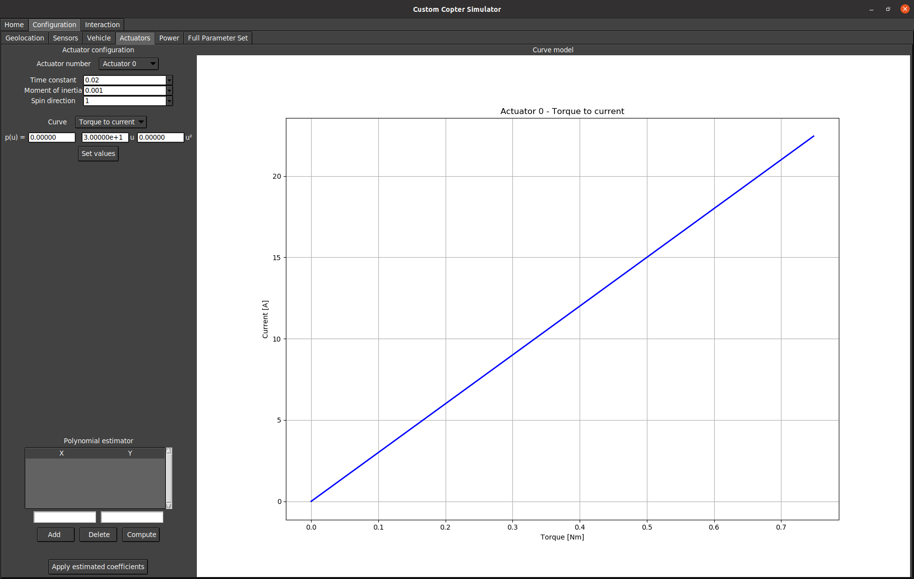
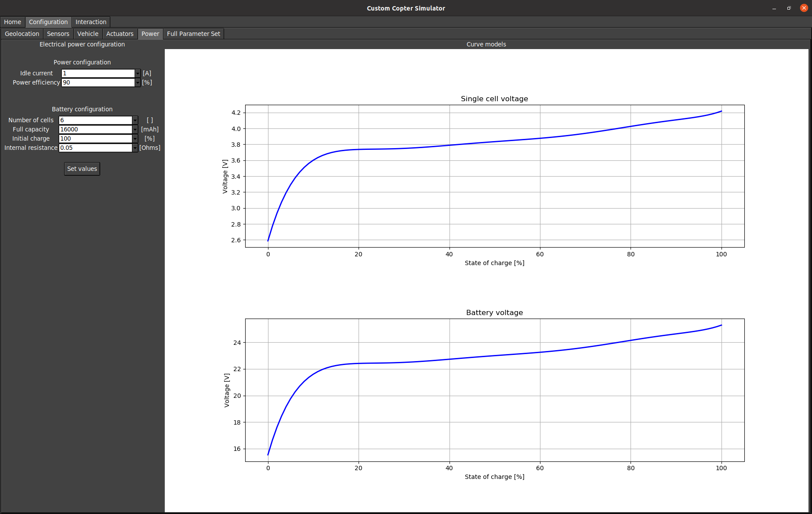
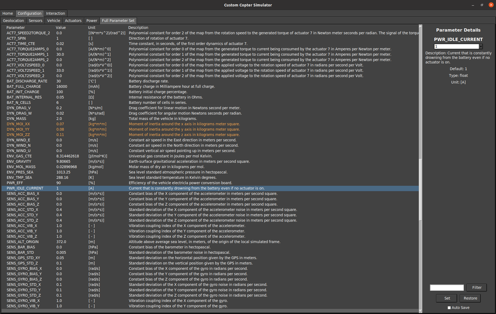

# sim4cd - Simulator for a Custom Drone

This package is a simulator tailored for quadcopters with fixed rotors. It offers configurable drone characteristics, allowing users to replicate their own platform. Currently, the simulator integrates seamlessly with PX4 firmware.

## Docker setup

Clone sim4cd

```bash
mkdir -p ~/simulation_ws/src
cd ~/simulation_ws/src
git clone https://github.com/adrianomcr/sim4cd.git
```

Build the image

```bash
docker compose -f docker-compose.yaml build
```

Give docker access to the X server

```bash
xhost +local:docker
```

Run the docker container

```bash
docker compose -f docker-compose.yaml run --rm sim4cd bash
```

Within the docker container, run the legacy Tk GUI

```bash
rosrun sim4cd sim_gui.py
```

The Docker image currently packages that Tk GUI, not the Qt GUI below.

## Native setup

Clone PX4

```bash
cd ~/catkin_ws/src
git clone --depth 1 --branch v1.13.3 https://github.com/PX4/PX4-Autopilot.git PX4
git -C PX4 submodule update --depth 1 --init --recursive
cd PX4
make distclean
```

Install the build-time Python dependencies from PX4's own requirements file. One line in it uses a version specifier that pip 24+ rejects (`matplotlib>=3.0.*`), so patch it first:
```bash
sed -i 's|matplotlib>=3.0\.\*|matplotlib>=3.0|' Tools/setup/requirements.txt
```

Then, on Ubuntu 20.04/22.04:

```bash
pip3 install -r Tools/setup/requirements.txt
pip3 install 'empy==3.3.4'
```

On Ubuntu 23.04 and later (including 24.04), pip refuses to install into the system Python and fails with `error: externally-managed-environment` (PEP 668). Add `--user --break-system-packages`, which installs into `~/.local` without touching any apt-owned file:


A virtualenv works too, but it must stay **activated while running `make`**, since the PX4 build shells out to `python3` for code generation.

The second `empy` command is required on every distro. v1.13.3 asks for `empy>=3.3`, which now resolves to 4.x, and 4.x breaks the PX4 uORB code generation with `module 'em' has no attribute 'RAW_OPT'`.

Build SITL
```bash
DONT_RUN=1 make px4_sitl none_iris
```

On GCC 12 and newer (Ubuntu 22.04 ships GCC 11, 24.04 ships GCC 13), this fails in `src/lib/matrix` with `error: array subscript 1 is above array bounds of 'float [1][1]' [-Werror=array-bounds]`. It is a false positive in an unreachable branch of `matrix::inv()`, fixed in later PX4 releases. Stop v1.13.3 from treating warnings as errors and rebuild:
```bash
sed -i 's|^\(\s*\)-Werror$|\1-Wno-error|' cmake/px4_add_common_flags.cmake
DONT_RUN=1 make px4_sitl none_iris
```

The Qt GUI starts PX4 from `~/catkin_ws/src/PX4` (`scripts/sim4cd/start_sim.sh`). If you cloned it elsewhere, symlink it or edit that path.

Install MAVROS (optional)

```bash
sudo apt install ros-noetic-mavros
roscd mavros/../../lib/mavros/
sudo ./install_geographiclib_datasets.sh
pip3 install pymavlink
```

MAVROS needs ROS Noetic, so it is Ubuntu 20.04 only. The Qt GUI does not need it: `start_sim.sh` just runs `sim4cd_main.py` and the PX4 binary, and `sim4cd_main.py` talks MAVLink directly through `pymavlink`. Skip this section on 22.04/24.04 unless you want the ROS bridge and `catkin build`.

Install QGroundControl

```bash
sudo usermod -a -G dialout $USER # Needs to log out and log in
sudo apt-get remove modemmanager -y
sudo apt install gstreamer1.0-plugins-bad gstreamer1.0-libav gstreamer1.0-gl -y
sudo apt install libqt5gui5 -y
sudo apt install libfuse2 -y
```

Download the AppImage from [https://docs.qgroundcontrol.com/master/en/qgc-user-guide/getting_started/download_and_install.html](https://docs.qgroundcontrol.com/master/en/qgc-user-guide/getting_started/download_and_install.html).

```bash
cd ~/Downloads
chmod +x ./QGroundControl.AppImage
```

## Clone repo and build

The Qt GUI lives on the `add-python-qt-gui` branch.

```bash
mkdir -p ~/catkin_ws/src
cd ~/catkin_ws/src
git clone -b add-python-qt-gui https://github.com/adrianomcr/sim4cd.git
cd ~/catkin_ws
catkin build
```

## Qt GUI

The Qt GUI is the main way to load a vehicle config and start the simulator (`Start Simulator` runs `scripts/sim4cd/start_sim.sh`).

### System packages

```bash
sudo apt update
sudo apt install -y python3-venv python3-pip python3-dev \
  libgl1 libglib2.0-0 libxkbcommon-x11-0 \
  libxcb-xinerama0 libxcb-cursor0 libxcb-icccm4 \
  libxcb-image0 libxcb-keysyms1 libxcb-randr0 \
  libxcb-render-util0 libxcb-shape0
```

On Ubuntu 24.04, install `python3.12-venv` if `python3-venv` is not available. You can skip `libglib2.0-0` if apt reports it was renamed to `libglib2.0-0t64`.

### Python dependencies (venv)

Ubuntu 24.04 blocks installing pip packages into the system Python. Use a virtualenv:

```bash
cd ~/catkin_ws/src/sim4cd   # or wherever you cloned the repo
python3 -m venv .venv
source .venv/bin/activate
pip install -r requirements.txt
```

`vtk` is pinned to 9.4.1 in `requirements.txt` (9.6+ rotates the home-tab skybox).

### Run

From `scripts/qt_gui`, with `scripts/` on `PYTHONPATH` so `sim4cd` imports resolve:

```bash
cd ~/catkin_ws/src/sim4cd/scripts/qt_gui
PYTHONPATH=.. python3 qt_sim4cd.py
```

Alternatively, from the repo root with the venv active:

```bash
pip install -e .
sim4cd-gui
```

PX4 SITL is expected at `~/catkin_ws/src/PX4` (see `scripts/sim4cd/start_sim.sh`). QGroundControl is used as the GCS.

## Legacy Tk GUI

The older Tk GUI is still in `scripts/gui/sim_gui.py`.

```bash
sudo apt-get install wmctrl
pip3 install ttkthemes magnetic_field_calculator
```

```bash
rosrun sim4cd sim_gui.py
```

GUI Home tab  


GUI Configuration: geographic location and local magnetic field  


GUI Configuration: sensors properties  


GUI Configuration: actuators properties  


GUI Configuration: battery and efficiency properties  


GUI Configuration: full list of simulator parameters  
