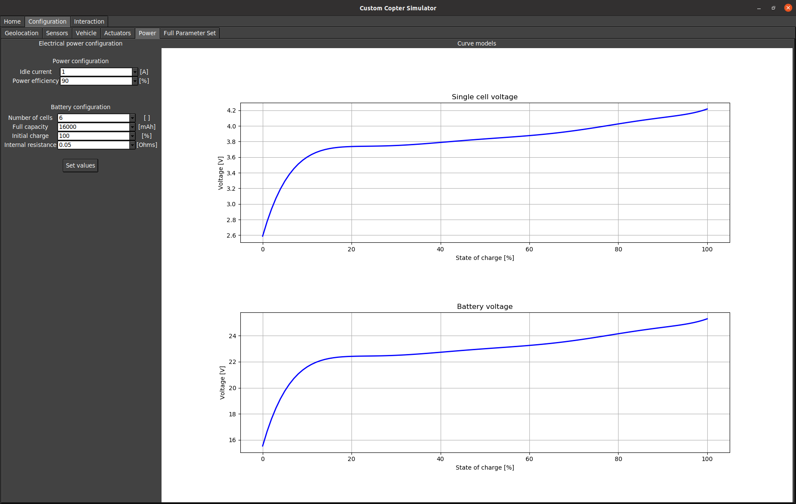

# px4sim
Quadcopter simulator for px4


## Setup

Install PX4
```bash
git clone https://github.com/PX4/PX4-Autopilot.git --recursive
git checkout v1.13.3
git submodule update --recursive
make distclean

pip3 install kconfiglib
pip3 install --user packaging
pip3 install --user jinja2
pip3 install --user jsonschema
pip3 install --user toml
make px4_sitl none_iris

```

Instal MavRos
```bash
sudo apt install ros-noetic-mavros
roscd mavros/../../lib/mavros/
sudo ./install_geographiclib_datasets.sh
pip3 install pymavlink
```


Install QGroundControl
```bash
sudo usermod -a -G dialout $USER # Needs to log out and log in
sudo apt-get remove modemmanager -y
sudo apt install gstreamer1.0-plugins-bad gstreamer1.0-libav gstreamer1.0-gl -y
sudo apt install libqt5gui5 -y
sudo apt install libfuse2 -y
```
Ownload the AppImage from https://docs.qgroundcontrol.com/master/en/qgc-user-guide/getting_started/download_and_install.html.
```bash
cd ~/Downloads
chmod +x ./QGroundControl.AppImage
```

## Clone repo and build

```bash
mkdir -p ~/simulation_ws/src
cd ~/simulation_ws/src
git clone https://github.com/adrianomcr/px4sim.git
catkin build
```


## GUI

### Install depenndencies

```bash
pip3 install ttkthemes
pip3 install magnetic_field_calculator
```

GUI Home tab\


GUI Configuration: geographic location and local magnetic field\


GUI Configuration: sensors properties\


GUI Configuration: actuators properties\


GUI Configuration: battery and efficiency properties\


GUI Configuration: full list of simulator parameters\

